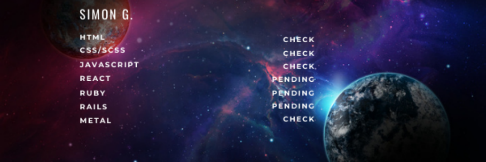

### Hello there stranger.Yes, you.

My name is Simon and I come from Macedonia. I'm currently enrolled in Microverse,learning and extending 
my web-development knowledge and skills while pair-programming with coding partners around the globe.

#### Programography: 
 - HTML
 - CSS
 - SCSS
 - Bootstrap
 - JavaScript
 - currently learning: React

#### You can reach me:
- [Github](https://github.com/SimonGrchevski)
- [LinkedIn](https://www.linkedin.com/in/simon-grchevski-682935209/)
- [Twitter](https://twitter.com/grchevski)

<!--
**SimonGrchevski/SimonGrchevski** is a ✨ _special_ ✨ repository because its `README.md` (this file) appears on your GitHub profile.

Here are some ideas to get you started:

- 🔭 I’m currently working on ...
- 🌱 I’m currently learning ...
- 👯 I’m looking to collaborate on ...
- 🤔 I’m looking for help with ...
- 💬 Ask me about ...
- 📫 How to reach me: ...
- 😄 Pronouns: ...
- ⚡ Fun fact: ...
-->
